# Thrift E-Commerce Platform

Thrift is a full-stack e-commerce marketplace platform built on a modern technology stack. It provides a robust backend API for managing products, users, and orders, and a responsive web frontend for both customers and vendors. The platform includes features like product variant management, a shopping cart, and a vendor analytics dashboard.

## Tech Stack

- **Monorepo:** [pnpm](https://pnpm.io/) Workspaces
- **Backend (`thrift-api`):** [Node.js](https://nodejs.org/), [Express](https://expressjs.com/), [TypeScript](https://www.typescriptlang.org/), [PostgreSQL](https://www.postgresql.org/), [Supabase](https://supabase.com/), [Knex.js](https://knexjs.org/)
- **Frontend (`thrift-web`):** [Next.js](https://nextjs.org/), [React](https://react.dev/), [TypeScript](https://www.typescriptlang.org/), [Tailwind CSS](https://tailwindcss.com/), [shadcn/ui](https://ui.shadcn.com/), [Jotai](https://jotai.org/)
- **Testing:** [Mocha](https://mochajs.org/), [Chai](https://www.chaijs.com/)

## Project Structure

This project is a monorepo containing the following key packages:

- `packages/thrift-api`: The core backend service. A RESTful API that handles all business logic, data storage, and user authentication.
- `packages/thrift-web`: The primary web interface. A Next.js application providing the customer-facing storefront, product pages, shopping cart, and a dashboard for vendors.
- `packages/cron-jobs`: A service for running scheduled background tasks, such as database maintenance or report generation.
- `packages/thrift-classical-search`: A dedicated service for handling product search and indexing.

## Architecture

### Database

#### Tables

| Name                                                                          | Columns | Comment | Type       |
| ----------------------------------------------------------------------------- | ------- | ------- | ---------- |
| [public.profiles](public.profiles.md)                                         | 12      |         | BASE TABLE |
| [public.address](public.address.md)                                           | 9       |         | BASE TABLE |
| [public.categories](public.categories.md)                                     | 4       |         | BASE TABLE |
| [public.subcategories](public.subcategories.md)                               | 5       |         | BASE TABLE |
| [public.payment_info](public.payment_info.md)                                 | 5       |         | BASE TABLE |
| [public.delivery_info](public.delivery_info.md)                               | 8       |         | BASE TABLE |
| [public.featured_product_collections](public.featured_product_collections.md) | 5       |         | BASE TABLE |
| [public.stores](public.stores.md)                                             | 9       |         | BASE TABLE |
| [public.pages](public.pages.md)                                               | 8       |         | BASE TABLE |
| [public.page_sections](public.page_sections.md)                               | 9       |         | BASE TABLE |
| [public.store_categories](public.store_categories.md)                         | 6       |         | BASE TABLE |
| [public.products](public.products.md)                                         | 11      |         | BASE TABLE |
| [public.product_options](public.product_options.md)                           | 5       |         | BASE TABLE |
| [public.product_option_values](public.product_option_values.md)               | 5       |         | BASE TABLE |
| [public.product_variants](public.product_variants.md)                         | 7       |         | BASE TABLE |
| [public.variant_to_option_values](public.variant_to_option_values.md)         | 4       |         | BASE TABLE |
| [public.product_store_category_links](public.product_store_category_links.md) | 4       |         | BASE TABLE |
| [public.featured_products](public.featured_products.md)                       | 8       |         | BASE TABLE |
| [public.featured_product_links](public.featured_product_links.md)             | 5       |         | BASE TABLE |
| [public.orders](public.orders.md)                                             | 10      |         | BASE TABLE |
| [public.order_items](public.order_items.md)                                   | 7       |         | BASE TABLE |
| [public.shopping_cart](public.shopping_cart.md)                               | 4       |         | BASE TABLE |
| [public.shopping_cart_item](public.shopping_cart_item.md)                     | 6       |         | BASE TABLE |
| [public.product_reviews](public.product_reviews.md)                           | 6       |         | BASE TABLE |
| [public.vendor_reviews](public.vendor_reviews.md)                             | 7       |         | BASE TABLE |
| [public.customer_reviews](public.customer_reviews.md)                         | 7       |         | BASE TABLE |
| [public.store_staff](public.store_staff.md)                                   | 5       |         | BASE TABLE |
| [public.inventory](public.inventory.md)                                       | 7       |         | BASE TABLE |
| [public.locations](public.locations.md)                                       | 7       |         | BASE TABLE |
| [public.product_variant_inventory](public.product_variant_inventory.md)       | 3       |         | VIEW       |
| [public.product_availability](public.product_availability.md)                 | 6       |         | BASE TABLE |
| [public.app_config](public.app_config.md)                                     | 5       |         | BASE TABLE |
| [public.media](public.media.md)                                               | 8       |         | BASE TABLE |
| [public.profile_media](public.profile_media.md)                               | 2       |         | BASE TABLE |
| [public.product_media_links](public.product_media_links.md)                   | 4       |         | BASE TABLE |

#### Stored procedures and functions

| Name                                         | ReturnType | Arguments                                          | Type     |
| -------------------------------------------- | ---------- | -------------------------------------------------- | -------- |
| public.trigger_set_timestamp                 | trigger    |                                                    | FUNCTION |
| public.product_media_display_landing_trigger | trigger    |                                                    | FUNCTION |
| public.handle_update_user                    | trigger    |                                                    | FUNCTION |
| public.handle_delete_user                    | trigger    |                                                    | FUNCTION |
| public.has_store_access                      | bool       | p_user_id uuid, p_store_id integer, p_roles text[] | FUNCTION |
| public.check_product_media_links_filetype    | trigger    |                                                    | FUNCTION |
| public.enforce_single_special_image          | trigger    |                                                    | FUNCTION |
| public.handle_new_user                       | trigger    |                                                    | FUNCTION |

#### Enums

| Name                              | Values                                                 |
| --------------------------------- | ------------------------------------------------------ |
| public.featured_product_type_enum | BEST_SELLER, CLEARANCE, FEATURED, NEW_ARRIVAL, ON_SALE |

#### Relations

```mermaid
    erDiagram

    "public.subcategories" }o--|| "public.categories" : "FOREIGN KEY (category_id) REFERENCES categories(category_id) ON DELETE CASCADE"
    "public.payment_info" }o--o| "public.profiles" : "FOREIGN KEY (customer_id) REFERENCES profiles(id) ON DELETE CASCADE"
    "public.delivery_info" }o--|| "public.profiles" : "FOREIGN KEY (customer_id) REFERENCES profiles(id) ON DELETE CASCADE"
    "public.delivery_info" }o--|| "public.address" : "FOREIGN KEY (address_id) REFERENCES address(address_id) ON DELETE CASCADE"
    "public.stores" }o--|| "public.profiles" : "FOREIGN KEY (vendor_id) REFERENCES profiles(id) ON DELETE CASCADE"
    "public.stores" }o--o| "public.address" : "FOREIGN KEY (address_id) REFERENCES address(address_id) ON DELETE CASCADE"
    "public.pages" }o--|| "public.stores" : "FOREIGN KEY (store_id) REFERENCES stores(store_id) ON DELETE CASCADE"
    "public.page_sections" }o--|| "public.pages" : "FOREIGN KEY (page_id) REFERENCES pages(page_id) ON DELETE CASCADE"
    "public.store_categories" }o--|| "public.stores" : "FOREIGN KEY (store_id) REFERENCES stores(store_id) ON DELETE CASCADE"
    "public.products" }o--|| "public.profiles" : "FOREIGN KEY (vendor_id) REFERENCES profiles(id) ON DELETE CASCADE"
    "public.products" }o--|| "public.categories" : "FOREIGN KEY (category_id) REFERENCES categories(category_id) ON DELETE CASCADE"
    "public.products" }o--|| "public.subcategories" : "FOREIGN KEY (subcategory_id) REFERENCES subcategories(subcategory_id) ON DELETE CASCADE"
    "public.products" }o--|| "public.stores" : "FOREIGN KEY (store_id) REFERENCES stores(store_id) ON DELETE CASCADE"
    "public.product_options" }o--|| "public.products" : "FOREIGN KEY (product_id) REFERENCES products(product_id) ON DELETE CASCADE"
    "public.product_option_values" }o--|| "public.product_options" : "FOREIGN KEY (option_id) REFERENCES product_options(option_id) ON DELETE CASCADE"
    "public.product_variants" }o--|| "public.products" : "FOREIGN KEY (product_id) REFERENCES products(product_id) ON DELETE CASCADE"
    "public.variant_to_option_values" }o--|| "public.product_option_values" : "FOREIGN KEY (value_id) REFERENCES product_option_values(value_id) ON DELETE CASCADE"
    "public.variant_to_option_values" }o--|| "public.product_variants" : "FOREIGN KEY (variant_id) REFERENCES product_variants(variant_id) ON DELETE CASCADE"
    "public.product_store_category_links" }o--|| "public.store_categories" : "FOREIGN KEY (store_category_id) REFERENCES store_categories(store_category_id) ON DELETE CASCADE"
    "public.product_store_category_links" }o--|| "public.products" : "FOREIGN KEY (product_id) REFERENCES products(product_id) ON DELETE CASCADE"
    "public.featured_products" }o--|| "public.products" : "FOREIGN KEY (product_id) REFERENCES products(product_id) ON DELETE CASCADE"
    "public.featured_product_links" }o--|| "public.featured_product_collections" : "FOREIGN KEY (collection_id) REFERENCES featured_product_collections(collection_id) ON DELETE CASCADE"
    "public.featured_product_links" }o--|| "public.products" : "FOREIGN KEY (product_id) REFERENCES products(product_id) ON DELETE CASCADE"
    "public.orders" }o--|| "public.profiles" : "FOREIGN KEY (customer_id) REFERENCES profiles(id) ON DELETE CASCADE"
    "public.orders" }o--o| "public.delivery_info" : "FOREIGN KEY (delivery_info_id) REFERENCES delivery_info(delivery_info_id) ON DELETE SET NULL"
    "public.orders" }o--|| "public.stores" : "FOREIGN KEY (store_id) REFERENCES stores(store_id) ON DELETE CASCADE"
    "public.order_items" }o--|| "public.product_variants" : "FOREIGN KEY (variant_id) REFERENCES product_variants(variant_id) ON DELETE CASCADE"
    "public.order_items" }o--|| "public.orders" : "FOREIGN KEY (order_id) REFERENCES orders(order_id) ON DELETE CASCADE"
    "public.shopping_cart" |o--|| "public.profiles" : "FOREIGN KEY (customer_id) REFERENCES profiles(id) ON DELETE CASCADE"
    "public.shopping_cart_item" }o--|| "public.product_variants" : "FOREIGN KEY (variant_id) REFERENCES product_variants(variant_id) ON DELETE CASCADE"
    "public.shopping_cart_item" }o--|| "public.shopping_cart" : "FOREIGN KEY (cart_id) REFERENCES shopping_cart(cart_id) ON DELETE CASCADE"
    "public.product_reviews" }o--|| "public.profiles" : "FOREIGN KEY (customer_id) REFERENCES profiles(id) ON DELETE CASCADE"
    "public.product_reviews" |o--|| "public.order_items" : "FOREIGN KEY (order_item_id) REFERENCES order_items(order_item_id) ON DELETE CASCADE"
    "public.vendor_reviews" }o--|| "public.profiles" : "FOREIGN KEY (customer_id) REFERENCES profiles(id) ON DELETE CASCADE"
    "public.vendor_reviews" }o--|| "public.profiles" : "FOREIGN KEY (vendor_id) REFERENCES profiles(id) ON DELETE CASCADE"
    "public.vendor_reviews" }o--|| "public.orders" : "FOREIGN KEY (order_id) REFERENCES orders(order_id) ON DELETE CASCADE"
    "public.customer_reviews" }o--|| "public.profiles" : "FOREIGN KEY (customer_id) REFERENCES profiles(id) ON DELETE CASCADE"
    "public.customer_reviews" }o--|| "public.profiles" : "FOREIGN KEY (vendor_id) REFERENCES profiles(id) ON DELETE CASCADE"
    "public.customer_reviews" }o--|| "public.orders" : "FOREIGN KEY (order_id) REFERENCES orders(order_id) ON DELETE CASCADE"
    "public.store_staff" }o--|| "public.profiles" : "FOREIGN KEY (staff_id) REFERENCES profiles(id) ON DELETE CASCADE"
    "public.store_staff" }o--|| "public.stores" : "FOREIGN KEY (store_id) REFERENCES stores(store_id) ON DELETE CASCADE"
    "public.inventory" }o--|| "public.product_variants" : "FOREIGN KEY (variant_id) REFERENCES product_variants(variant_id) ON DELETE CASCADE"
    "public.inventory" }o--o| "public.locations" : "FOREIGN KEY (location_id) REFERENCES locations(location_id) ON DELETE CASCADE"
    "public.locations" }o--o| "public.address" : "FOREIGN KEY (address_id) REFERENCES address(address_id) ON DELETE CASCADE"
    "public.locations" }o--|| "public.stores" : "FOREIGN KEY (store_id) REFERENCES stores(store_id) ON DELETE CASCADE"
    "public.product_availability" }o--|| "public.products" : "FOREIGN KEY (product_id) REFERENCES products(product_id) ON DELETE CASCADE"
    "public.media" }o--|| "public.profiles" : "FOREIGN KEY (uploader_id) REFERENCES profiles(id) ON DELETE CASCADE"
    "public.profile_media" |o--|| "public.profiles" : "FOREIGN KEY (profile_id) REFERENCES profiles(id) ON DELETE CASCADE"
    "public.profile_media" |o--|| "public.media" : "FOREIGN KEY (media_id) REFERENCES media(media_id) ON DELETE CASCADE"
    "public.product_media_links" }o--|| "public.product_variants" : "FOREIGN KEY (variant_id) REFERENCES product_variants(variant_id) ON DELETE CASCADE"
    "public.product_media_links" }o--|| "public.media" : "FOREIGN KEY (media_id) REFERENCES media(media_id) ON DELETE CASCADE"

    "public.profiles" {
    uuid id
    varchar*30* first*name
    varchar_30* last*name
    varchar_320* email
    varchar*40* phone
    date dob
    varchar country
    boolean is*customer
    boolean is_vendor
    timestamp_with_time_zone deleted_at
    timestamp_with_time_zone created_at
    timestamp_with_time_zone updated_at
    }
    "public.address" {
    integer address_id
    varchar address_line_1
    varchar address_line_2
    varchar city
    varchar state
    varchar zip_postal_code
    varchar country
    timestamp_with_time_zone created_at
    timestamp_with_time_zone updated_at
    }
    "public.categories" {
    integer category_id
    varchar category_name
    timestamp_with_time_zone created_at
    timestamp_with_time_zone updated_at
    }
    "public.subcategories" {
    integer subcategory_id
    integer category_id
    varchar subcategory_name
    timestamp_with_time_zone created_at
    timestamp_with_time_zone updated_at
    }
    "public.payment_info" {
    integer payment_id
    varchar payment_token
    timestamp_with_time_zone created_at
    timestamp_with_time_zone updated_at
    uuid customer_id
    }
    "public.delivery_info" {
    integer delivery_info_id
    uuid customer_id
    varchar_30* recipient*full_name
    integer address_id
    varchar phone_number
    timestamp_with_time_zone created_at
    timestamp_with_time_zone updated_at
    varchar delivery_instructions
    }
    "public.featured_product_collections" {
    integer collection_id
    varchar_255* name
    text description
    timestamp*with_time_zone created_at
    timestamp_with_time_zone updated_at
    }
    "public.stores" {
    integer store_id
    varchar store_name
    varchar custom_domain
    uuid vendor_id
    varchar favicon
    jsonb global_styles
    integer address_id
    timestamp_with_time_zone created_at
    timestamp_with_time_zone updated_at
    }
    "public.pages" {
    integer page_id
    integer store_id
    varchar page_slug
    varchar page_title
    varchar page_type
    jsonb seo_data
    timestamp_with_time_zone created_at
    timestamp_with_time_zone updated_at
    }
    "public.page_sections" {
    integer section_id
    integer page_id
    varchar section_title
    varchar section_type
    jsonb section_data
    integer sort_order
    jsonb styles
    timestamp_with_time_zone created_at
    timestamp_with_time_zone updated_at
    }
    "public.store_categories" {
    integer store_category_id
    integer store_id
    varchar_255* name
    text description
    timestamp*with_time_zone created_at
    timestamp_with_time_zone updated_at
    }
    "public.products" {
    integer product_id
    varchar title
    text__ description
    numeric_19_4* list*price
    numeric_19_4* net*price
    uuid vendor_id
    integer store_id
    integer category_id
    integer subcategory_id
    timestamp_with_time_zone created_at
    timestamp_with_time_zone updated_at
    }
    "public.product_options" {
    integer option_id
    integer product_id
    varchar option_name
    timestamp_with_time_zone created_at
    timestamp_with_time_zone updated_at
    }
    "public.product_option_values" {
    integer value_id
    integer option_id
    varchar value
    timestamp_with_time_zone created_at
    timestamp_with_time_zone updated_at
    }
    "public.product_variants" {
    integer variant_id
    integer product_id
    varchar sku
    numeric_19_4* list*price
    numeric_19_4* net*price
    timestamp_with_time_zone created_at
    timestamp_with_time_zone updated_at
    }
    "public.variant_to_option_values" {
    integer variant_id
    integer value_id
    timestamp_with_time_zone created_at
    timestamp_with_time_zone updated_at
    }
    "public.product_store_category_links" {
    integer product_id
    integer store_category_id
    timestamp_with_time_zone created_at
    timestamp_with_time_zone updated_at
    }
    "public.featured_products" {
    integer featured_product_id
    integer product_id
    featured_product_type_enum feature_type
    timestamp_with_time_zone start_date
    timestamp_with_time_zone end_date
    integer sort_order
    timestamp_with_time_zone created_at
    timestamp_with_time_zone updated_at
    }
    "public.featured_product_links" {
    integer collection_id
    integer product_id
    integer sort_order
    timestamp_with_time_zone created_at
    timestamp_with_time_zone updated_at
    }
    "public.orders" {
    integer order_id
    uuid customer_id
    integer store_id
    integer delivery_info_id
    timestamp_with_time_zone order_date
    numeric_10_2* total*amount
    text status
    timestamp_with_time_zone created_at
    timestamp_with_time_zone updated_at
    varchar_255* payment*reference
    }
    "public.order_items" {
    integer order_item_id
    integer order_id
    integer variant_id
    integer quantity
    numeric_19_4* price*at_purchase
    timestamp_with_time_zone created_at
    timestamp_with_time_zone updated_at
    }
    "public.shopping_cart" {
    integer cart_id
    uuid customer_id
    timestamp_with_time_zone created_at
    timestamp_with_time_zone updated_at
    }
    "public.shopping_cart_item" {
    integer item_id
    integer cart_id
    integer variant_id
    integer quantity
    timestamp_with_time_zone created_at
    timestamp_with_time_zone updated_at
    }
    "public.product_reviews" {
    integer order_item_id
    numeric_3_2* rating
    uuid customer*id
    varchar customer_remark
    timestamp_with_time_zone created_at
    timestamp_with_time_zone updated_at
    }
    "public.vendor_reviews" {
    uuid vendor_id
    uuid customer_id
    integer order_id
    numeric_3_2* rating
    varchar customer*remark
    timestamp_with_time_zone created_at
    timestamp_with_time_zone updated_at
    }
    "public.customer_reviews" {
    uuid customer_id
    uuid vendor_id
    integer order_id
    numeric_3_2* rating
    varchar vendor*remark
    timestamp_with_time_zone created_at
    timestamp_with_time_zone updated_at
    }
    "public.store_staff" {
    integer store_id
    uuid staff_id
    varchar role
    timestamp_with_time_zone created_at
    timestamp_with_time_zone updated_at
    }
    "public.inventory" {
    integer inventory_id
    integer variant_id
    integer quantity_change
    varchar reason
    text notes
    timestamp_with_time_zone created_at
    integer location_id
    }
    "public.locations" {
    integer location_id
    integer store_id
    varchar location_name
    integer address_id
    boolean is_primary
    timestamp_with_time_zone created_at
    timestamp_with_time_zone updated_at
    }
    "public.product_variant_inventory" {
    integer variant_id
    integer location_id
    bigint quantity_available
    }
    "public.product_availability" {
    integer availability_id
    integer product_id
    timestamp_with_time_zone available_from
    timestamp_with_time_zone available_until
    text notes
    timestamp_with_time_zone created_at
    }
    "public.app_config" {
    varchar config_key
    varchar config_value
    text description
    timestamp_with_time_zone created_at
    timestamp_with_time_zone updated_at
    }
    "public.media" {
    integer media_id
    varchar filename
    varchar filepath
    varchar_50* filetype
    text description
    uuid uploader_id
    timestamp_with_time_zone created_at
    timestamp_with_time_zone updated_at
    }
    "public.profile_media" {
    uuid profile_id
    integer media_id
    }
    "public.product_media_links" {
    integer variant_id
    integer media_id
    boolean is_display_image
    boolean is_thumbnail_image
    }
```



> Generated by [tbls](https://github.com/k1LoW/tbls)

---

## Getting Started

1.  **Clone the repository:**

    ```bash
    git clone https://github.com/Dan6200/thrift-platform-core
    cd Thrift
    ```

2.  **Install dependencies:**
    Install all dependencies from the root of the monorepo using pnpm.

    ```bash
    pnpm install
    ```

3.  **Setup Backend Environment:**
    The backend relies on a Supabase instance managed via Docker.

    ```bash
    cd packages/thrift-api
    supabase start
    ```

4.  **Run Development Servers:**
    You can run the backend and frontend services concurrently from the root directory.
    - **Run the API:**
      ```bash
      pnpm --filter thrift-api dev
      ```
    - **Run the Web App:**
      ```bash
      pnpm --filter thrift-web dev
      ```

## Running Tests

To run the backend integration tests, navigate to the `thrift-api` package and use the provided script.

```bash
cd packages/thrift-api
pnpm tests
```
